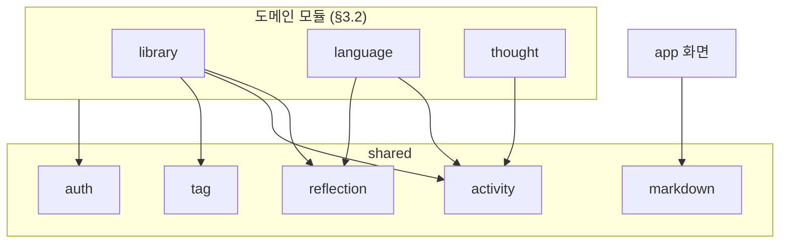
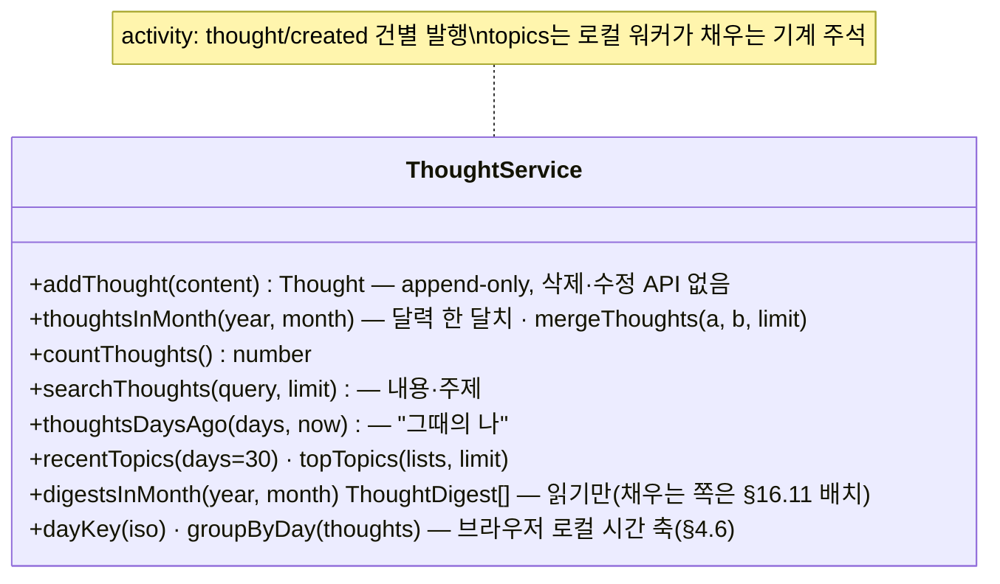

> LSHobby 설계 문서 — 목차·로드맵·§번호↔파일 매핑은 [README](README.md) 참조

> **개정 (2026-09-02, 코드 대조)**: 클래스 블록을 각 모듈 `index.ts`의 실제 export대로 전면 갱신(함수명·시그니처), thought 모듈·독서 여정·markdown 추가, Concept/WikiLink는 사료, 신규 한도 삭제(#81), 불변식 4 개정(홈은 count API), 알려진 예외 기록(#83).
> **개정 (2026-08-20, 결정 #57~61 반영 완료)**: CS 세션 제거 · 인용구 삭제가 코드(커밋 6246582~)와 DB(마이그레이션 20260820090000 · 20260820100000)에 모두 반영됐다. 본문은 현행 상태로 개정됨 — CS/quote 관련 폐기 항목은 사료 표시.

## 15. 설계 클래스 다이어그램 (DCD) — 확정 (2026-08-14)

구현이 TypeScript 모듈(함수) 중심이므로 여기서 "클래스" = **모듈의 공개 인터페이스**(§3.4-1: `index.ts`로만 노출되는 서비스)와 언어 config 타입이다. DB 스키마의 원본은 §9(ERD/DDL) — 이 문서는 **코드 관점의 책임과 의존 방향**을 고정한다.

### 15.1 모듈 의존 방향 (전체 조감)



- 화살표 = 허용된 의존. **역방향(shared → 도메인)·도메인 간 직접 의존은 금지**(§3.4)
- 도메인 간 정보 전달은 `activity` 이벤트 발행이 유일한 통로. ~~홈은 activity만 읽는다~~ → 홈은 각 모듈의 **count 공개 API**(`countBooks`·`countWords`·`countThoughts`)로 서랍 숫자를 만든다(#69). `activity_feed`는 앱 화면 소비처가 없다 — 배치(§16.11·16.12)가 읽는다
- language → reflection은 삭제 정리(`deleteWord`) 용도뿐 — 단어 화면에 reflection 블록은 아직 없다(§11.7). **현재는 공개 API 대신 테이블을 직접 다룬다(알려진 예외, §3.4·#83)**

### 15.2 shared 모듈

```mermaid
classDiagram
    class ReflectionService {
        +getTimeline(subjectType, subjectId) ReflectionEntry[]
        +addEntry(subjectType, subjectId, content, context) void
        +removeThread(subjectType, subjectId) void
        +ReflectionBlock(subject) 컴포넌트
    }
    class ActivityService {
        +publish(domain, entityType, entityId, action, summary) void
        +upsertDaily(domain, entityType, entityId, action, summary, now?) void
        +getFeed(limit=30, before?) FeedItem[]
    }
    class TagService {
        +tagsOf(subjectType, subjectId) string[]
        +tagsByType(subjectType) Map~id, string[]~
        +setTags(subjectType, subjectId, names) void
        +removeTaggings(subjectType, subjectId) void
    }
    class Auth {
        +supabase 클라이언트(브라우저)
        +serverClientWithToken(token) 서버 라우트용
        +AuthGuard 컴포넌트 — 세션 없으면 /login
        +signIn(email, password) error?
        +signOut() void
        +updatePassword(newPassword) error?
    }
    class Markdown {
        +Markdown(children, components?) 컴포넌트 — remark-gfm + rehype-sanitize
    }
    note for ReflectionService "addEntry: 스레드 없으면 자동 생성 (엔티티당 1개)\nentry 수정·삭제 API 없음 — append-only (§4.2)\nremoveThread: 엔티티 삭제 시 앱 레이어 정리용(§14.7) — entry는 DB cascade"
    note for ActivityService "upsertDaily: 언어 학습 일별 요약용 — 당일 같은 키면 갱신 (§6.4)\ngetFeed: 노출만 — 앱 화면 호출처 없음(#53 이후)"
```



- reflection 블록의 **렌더링도 shared 소유**(§11.7) — 도메인 화면은 subject만 넘긴다
- `search/`는 `export {}` 빈 스텁 — 검색은 도메인별(단어장 클라이언트 필터, `searchThoughts`)
- 다형 참조(subjectType+subjectId)의 무결성 책임은 이 서비스들을 호출하는 앱 레이어에 있음(§4.5, 삭제는 §14.7)

### 15.3 language 모듈 — config 주입 구조 (§6.2)

```mermaid
classDiagram
    class LanguageConfig {
        <<interface>>
        +code, label
        +wordTable, reviewLogTable, sentenceTable, sentenceFetchTable
        +wordStatsFn, dailyStatsFn — 집계 RPC명 (#62)
        +tatoebaLang, transLangs — 예문 수집
        +normalize(word) string — 중복 차단 norm
        +gradeLenient: ((s) => string) | null — 관대 비교 변형
        +hasGender: boolean
        +speechLang, inputPlaceholder, accentChars, altKeyMap
    }
    class EsConfig {
        +code es · es_words · es_word_stats/es_daily_stats
        +normalize 악센트 제거·ñ 유지
        +gradeLenient 모음 악센트 관대
        +hasGender true · speechLang es-ES
    }
    class EnConfig {
        +code en · en_words · en_word_stats/en_daily_stats
        +normalize trim·소문자
        +gradeLenient null (정확 일치)
        +hasGender false · speechLang en-US
    }
    class Registry {
        +languageConfigs, configFor(code)
        +useCurrentConfig(), setCurrentLang(code) — localStorage 전역 (#54)
    }
    class Grading {
        +gradeAnswer(input, expected, direction, config) GradeResult
        +answerAlternatives(expected) string[] — 콤마 동의어
    }
    class WordService {
        +listWords(config) · countWords(config) · findByNorm(config, word)
        +addWord(config, …) · updateWord(config, id, …) · deleteWord(config, id)
    }
    class Session {
        +loadDeck(config, now) {words, due, stats}
        +practiceOrder(words, stats, now, rand) Word[] — §6.3 #82
        +answerWord(…) — FSRS 반영 + review_log + activity 일별 upsert
        +reviewStats(config) Map~id, WordStat~ — RPC
    }
    class Srs {
        +isNew(row) · isDue(row, now)
        +ratingFor(correct) Grade — Good/Again
        +applyAnswer(row, correct, now) {fields, rating}
    }
    class Stats {
        +fetchStats(config, words) LangStats — 스트릭·정답률·stateCounts·14일
        +aggregate · aggregateDaily · computeStreak · localDate
        +todayReviewSummary(config, now)
        +buildCsv(words, perWord) string
    }
    class Sentence {
        +ensureSentences(config, wordId) Sentence[] — 없으면 /api/sentence 경유 수집
    }
    class Display {
        +promptMeaning(meaning) — 앞 두 뜻 (#79)
        +clozeIndex(text, word) — 유니코드 단어 경계 (#76)
        +articleFor(gender) · stateLabel(state)
    }

    LanguageConfig <|.. EsConfig
    LanguageConfig <|.. EnConfig
    WordService ..> LanguageConfig : normalize 중복 차단
    Grading ..> LanguageConfig : gradeLenient
    Session ..> Srs : Good·Again 전달
    Session ..> Sentence : cloze 예문
    Srs ..> tsfsrs : 라이브러리
    class tsfsrs {
        <<library>>
    }
```

- **언어 추가 = config 구현 1개 + 테이블 복제 + RPC 2종** — 서비스 코드는 전 언어 공용 한 벌(FR-18의 구현 형태). 모든 서비스 함수는 첫 인자로 `config`를 받는다
- 출제 순서(정답률 오름차순)·복습 통계는 전부 `*_review_log` 파생(RPC) — 카운터 상태 없음(#36). ~~신규 한도·어려운 단어 판정~~은 #81로 폐기
- 예문 수집의 Tatoeba 실호출은 서버 라우트(`app/api/sentence`)와 `tatoeba.ts`에 있다 — 서비스 키 미노출. 라우트가 내부 파일을 직접 import하는 것은 알려진 예외(§3.4·#83)

### 15.4 library 모듈

```mermaid
classDiagram
    class BookService {
        +listBooks() BookListItem[] — 전량(검색은 화면 필터 없음, 목차가 대체 #58)
        +getBook(id) {book, readings}?
        +countBooks() number
        +createBook(fields) Book · updateBook(id, fields)
        +recordCompletion(book, finishedOn, rating) 누적 회독 수
        +saveNote(book, markdown) void
        +deleteBook(id) void
    }
    class Journey {
        +VOL_CAP = 20 — 한 보(步)
        +sortJourney(books) · journeyNumbers(books) Map~id, no~
        +chunkVolumes(journey) BookListItem[][]
        +previewJourneyNo(…) — 독서 기록 2단계 속표지 미리보기
        +volOf(no) · noInVol(no) · bookNav(…)
    }
    note for BookService "recordCompletion: reflection 작성 시\ncontext 'N회독' 자동 기입 (§7.2)\ndeleteBook: §14.7 두 갈래 — removeThread + removeTaggings 후 book 삭제(reading은 cascade)"
    note for Journey "순수 함수 — 책장·펼친 책 UI(app/library)의 계산 전부"
```

~~`addQuote`~~ — quote 테이블과 함께 폐기(#58, 마이그레이션 20260820100000).

### 15.4b thought 모듈 (2026-08-21~)



<details><summary>~~ConceptService · WikiLinkParser~~ — 사료 (CS 폐기 #57, 2026-08-20)</summary>

```
ConceptService: save(id, title, body, tags) · rename(id, newTitle) · remove(id) · backlinks(id) · search(query, tag)
WikiLinkParser: extract(markdown) · resolve(titles) · replaceTitle(markdown, oldT, newT)
rename은 참조 본문 일괄 치환 후 재저장, remove는 §14.7 두 갈래 삭제 — 구현되지 않고 폐기됨
```
</details>

### 15.5 테이블 소유권 (모듈 ↔ §9 DDL 매핑)

| 모듈 | 소유 테이블 | 비고 |
|---|---|---|
| shared | `reflection_thread` · `reflection_entry` · `activity_feed` · `tag` · `tagging` | 타 모듈은 서비스 경유로만 접근 |
| language | `es_words` · `es_review_log` · `es_sentences` · `es_sentence_fetch` · `en_*` 4종 | 언어 추가 = config + 테이블 복제 (#54) |
| library | `book` · `reading` | |
| thought | `thought` · `thought_digest` | digest는 로컬 LLM 워커(`scripts/digest-thoughts.mjs`)가 서비스 키로 채운다 — 앱은 읽기만 |

**각 모듈은 자기 테이블만 쿼리한다**(§3.4-2). 이 표가 코드 리뷰 때의 경계 판정 기준.
알려진 예외(#83): `language/words.ts`의 `deleteWord`가 shared 소유 `reflection_thread`를 직접 다룬다 — `removeThread`로 바꿔야 한다.

### 15.6 유지보수 불변식 요약

구현·수정 시 깨뜨리면 안 되는 것들 (원본 § 참조):

1. `reflection_entry`는 UPDATE/DELETE 경로가 코드에 존재하지 않는다 — append-only (§4.2)
2. 엔티티 삭제는 항상 두 갈래: DB cascade + 앱 레이어 다형 행 정리 (§14.7)
3. `activity_feed`는 어떤 삭제에도 휩쓸리지 않는다 — 영구 보존 (§9.3)
4. ~~홈은 `activity_feed` 외의 도메인 테이블을 읽지 않는다~~ → 홈은 각 모듈의 **count 공개 API만** 호출한다(테이블 직접 접근 금지). `activity_feed`는 앱 화면에서 읽지 않는다 — Notion 백업·다이제스트 배치 전용(#69 이후, 2026-09-02 개정)
5. 학습 수치는 전부 `*_review_log` 파생 — 카운터 컬럼을 새로 만들지 않는다 (#36)
6. 언어별 분기는 `LanguageConfig` 안에만 존재한다 — 서비스 코드에 `if (lang === 'es')` 금지 (§6.2)
