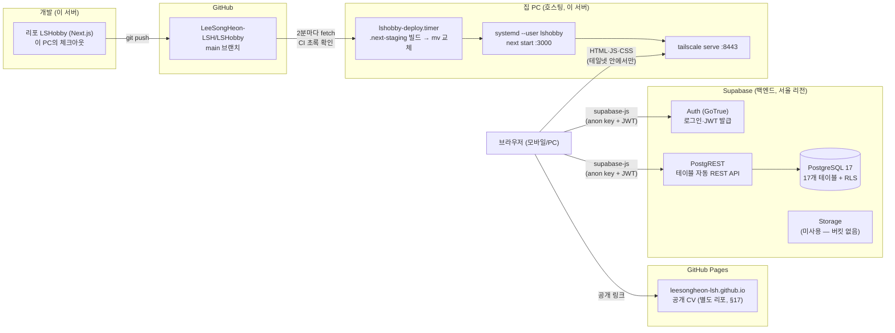
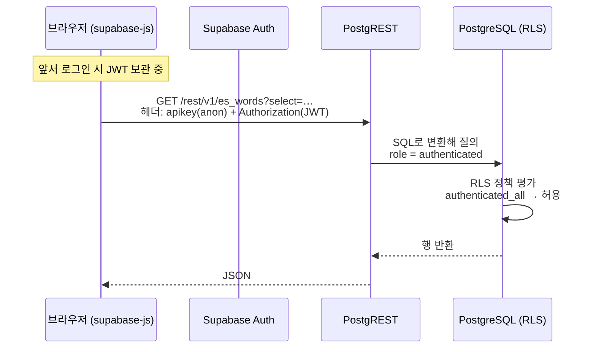
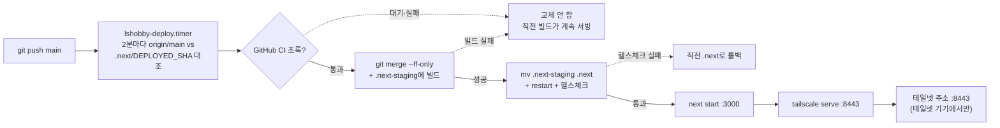

> LSHobby 설계 문서 — 목차·로드맵·§번호↔파일 매핑은 [README](README.md) 참조

## 16. 인프라 구조 해설 — 현재 상태 (2026-08-30 로컬 호스팅 전환 반영)

> **개정 (2026-09-02, 코드 대조)**: 배포 판정 기준이 `DEPLOYED_SHA`(#77), CI는 트리거가 아니라 게이트, 스크립트 사본 re-exec·deploy-state 두 상태·수동 배포 경로 정정(§16.2·16.5). 비밀 표에 Gemini·Notion 추가(§16.4). 다이제스트 KST 축(#78, §16.11). Notion은 DB 하나 + 유형 select(#80, §16.12). 수동·반자동 배치 절 신설(§16.13). Storage는 미사용.

§2(스택 선정 이유)·§12(보안 요구)의 결과물로 **실제로 세워진 인프라가 어떻게 맞물려 도는지**를 학습용으로 풀어쓴 문서. 규칙의 원본은 §12, 여기는 "왜 이렇게 생겼고 요청이 어디로 흐르는가"를 설명한다.

### 16.1 전체 그림



핵심 구조 두 가지:

1. **서버 코드가 거의 없는 구조** — 데이터 요청은 Next.js 서버를 거치지 않고 **브라우저 → Supabase 직행**이 기본이다. 호스팅(지금은 집 PC)은 화면(정적 자산)을 주는 역할, Supabase가 API·DB·인증 전부를 담당한다. 백엔드를 직접 짜는 대신 PostgREST가 테이블마다 REST API를 자동 생성해 준다.
2. **보안의 최종 방어선은 DB 안(RLS)에 있다** — API가 브라우저에 열려 있으므로, "누가 뭘 읽고 쓸 수 있나"는 서버 코드가 아니라 Postgres의 Row Level Security 정책이 결정한다(§16.3).

### 16.2 구성요소별 역할

| 구성요소 | 역할 | 우리 설정 |
|---|---|---|
| **GitHub** | 소스 저장 + CI | `main`·PR 푸시에 `npm run lint` + `npm test`. 푸시가 배포를 **시작시키지는 않지만**(2026-08-30 Vercel 연동 해제), 배포 타이머가 이 CI 결과를 **게이트**로 읽는다(§16.5) |
| **집 PC** | 빌드·호스팅 | `systemd --user lshobby` = `next start :3000`. 배포는 `lshobby-deploy.timer`가 **2분 주기 자동**(§16.5, 수동 실행도 같은 스크립트) |
| **Tailscale** | 외부 접근 | `tailscale serve :8443` — **테일넷 안에서만** 열린다. 인터넷 공개(funnel) 아님 |
| **Next.js** | 화면 + (필요 시) 서버 코드 | 16.x, App Router, `src/` 구조 — 모듈 경계는 §3 |
| **Supabase Auth** | 로그인·세션(JWT) | 이메일 로그인, **가입 서버 차단**(SEC-01), 계정 1개 |
| **PostgREST** | 테이블 → REST API 자동화 | supabase-js가 클라이언트. 모든 요청에 RLS 적용 |
| **PostgreSQL** | 데이터 원본 | §9 DDL = `supabase/migrations/` 파일로 형상 관리 |
| **Storage** | 파일(이미지) | **현재 사용처 없음** — CS 폐기(#57)로 버킷·정책 drop. 이미지 기능이 생기면 private 버킷 생성(SEC-04 조건부) |

### 16.3 데이터 요청 한 번이 흐르는 길

"단어장 목록을 연다"를 예로:



- **anon key**: "이 Supabase 프로젝트의 클라이언트"임을 나타내는 공개 가능한 키. 이것만으로는 role이 `anon`이라 **RLS에서 전부 거부**된다 (실측: SELECT 0행, INSERT 거부)
- **JWT**: 로그인 시 Auth가 발급. 이게 붙어야 role이 `authenticated`가 되고, 우리 정책("authenticated 전부 허용", #33)이 통과시킨다
- 즉 "로그인함 = 본인 = 전부 허용"이 성립하는 전제는 **가입이 서버에서 차단**돼 있다는 것(SEC-01). 이 사슬이 §12.4 위협 모델의 답이다

### 16.4 키·비밀 체계 (무엇이 어디에, 왜)

| 비밀 | 성격 | 위치 | 용도 |
|---|---|---|---|
| anon key | **공개돼도 됨** (RLS가 방어) | `.env`, 브라우저 번들 | 클라이언트 접속 |
| service_role key | **절대 비공개** — RLS를 통째로 우회 | `.env`(로컬), `~/.lshobby/api-keys.json` | 관리 작업(계정 생성·SEC-08 재설정), 추후 서버 코드 |
| DB 비밀번호 | 비공개 | `~/.lshobby/db-password` | `pg_dump` 백업(NFR-04), `supabase link` |
| 앱 로그인 비밀번호 | 본인만 | `~/.lshobby/app-password` (+비밀번호 관리자) | 앱 로그인. 분실 시 SEC-08 런북 |
| Supabase 대시보드 계정 | **최상위 복구 수단** | GitHub 로그인 | 모든 것의 마스터 키 |
| `GEMINI_API_KEY` | 비공개 (외부 API 실비밀) | `.env` | 배치 전용 — 예문·뜻 동의어 백필(§16.13). 앱 코드는 안 읽는다 |
| `NOTION_TOKEN` · `NOTION_BACKUP_DB_ID` | 비공개 | `.env` | Notion 백업 미러(§16.12). 구 `NOTION_DB_ID`·`NOTION_BOOK_DB_ID`·`NOTION_WORD_DB_ID`는 읽는 코드가 없다 |

> **정리 대상 (2026-09-02 확인)**: `.env`에 Vercel CLI가 남긴 `VERCEL_OIDC_TOKEN`, 그리고 코드 참조가 없는 `SUPABASE_SECRET_KEY`·`NEXT_PUBLIC_SUPABASE_PUBLISHABLE_KEY`가 남아 있다 — 제거해도 되는 잔여물. 반대로 `NOTION_BACKUP_DB_ID`는 **아직 `.env`에 없어** 백업 스크립트가 시작 즉시 종료한다(§16.12 참조).

규칙(SEC-03): 비밀은 `.env`(gitignore)로만 — 코드·리포에 하드코딩 금지. 호스팅이 집 PC로 내려오면서 원격 환경변수 저장소는 아예 없어졌다. **`NEXT_PUBLIC_` 접두사가 붙은 변수만 브라우저 번들에 들어간다**는 Next.js 규칙이 anon(공개)과 service_role(서버 전용)의 경계를 코드 레벨에서 지켜준다.

### 16.5 배포 — 집 PC 로컬 호스팅 + Tailscale (2026-08-30 전환, #73)

Vercel을 내리고 **이 PC가 프로덕션**이 됐다. 공개할 것은 CV 하나뿐인데 그건 이미 GitHub Pages로 나갔고(§17), 남은 취미공간은 나만 쓰므로 인터넷에 있을 이유가 없다. 배치(§16.11·§16.12)도 이미 이 PC의 cron이라 운영 지점이 한 곳으로 모인다.



- **배포 = `main` 푸시** (2026-08-30 자동화). `systemd --user` 타이머 `lshobby-deploy.timer`가 **2분마다** `scripts/deploy-local.sh`를 돌린다. 판정 기준은 **"지금 서빙 중인 빌드가 어느 커밋인가"** — `.next/DEPLOYED_SHA`와 origin/main이 다를 때만 받아서 빌드·교체한다(#77, 2026-08-31). HEAD와 origin을 비교하면 이 PC에서 직접 커밋·푸시할 때 둘이 함께 올라가 "받을 것 없음"이 되어 영영 배포되지 않는다. `DEPLOYED_SHA`는 빌드 성공 시 스테이징에 쓰고 `mv`와 함께 옮기므로 롤백하면 기록도 같이 되돌아간다. 손으로 하려면 **같은 스크립트**를 부른다(아래 계약을 전부 태우기 위해 — 맨손 `npm run build`는 `.next`를 먼저 비우고 `DEPLOYED_SHA`도 안 남긴다):
  ```bash
  DEPLOY_SKIP_CI=1 scripts/deploy-local.sh
  ```
  스크립트의 계약은 **"돌던 사이트를 내리지 않는다"** 다. `next build`는 `cleanDistDir` 기본값 때문에 컴파일 **전에** distDir을 비우므로, `.next`에 대고 빌드하면 빌드가 실패한 순간 사이트가 통째로 깨진다(재시작을 안 해도 소용없다 — 읽을 파일이 이미 없다). 그래서 빌드는 `NEXT_DIST_DIR=.next-staging`으로 딴 데 짓고, **빌드 성공 + 새 `BUILD_ID`가 실제로 200을 내는 것**까지 확인한 뒤에야 `mv`로 갈아끼운다:

  | 상황 | 동작 |
  |---|---|
  | 작업 트리가 더럽거나 `main`이 아님 | 건너뜀 (개발 중일 수 있다 — 이 PC가 개발기이자 서버다) |
  | 이 체크아웃에서 `npm run dev`가 돌고 있음 | 건너뜀 — 교체·재시작이 dev 서버를 깬다 |
  | 로컬 `main`이 origin보다 앞섬(푸시 전) | 건너뜀 — 배포할 것이 없다 |
  | 로컬 `main`이 origin과 **갈라짐** | 타이머를 **정지**시키고 `notify-send`로 부른다. 정리 후 `systemctl --user start lshobby-deploy.timer` |
  | CI가 아직 안 끝남 | 대기(2분 뒤 재시도). 30분을 넘기면 한 번 알린다 |
  | **CI 실패** | 배포하지 않고 해당 sha를 `blocked`로 기록 — 고친 커밋이 올라와야 다시 시도 |
  | `package-lock.json`이 바뀐 커밋 | `npm ci` 먼저 — 비교 구간은 **직전 배포 커밋(`DEPLOYED_SHA`) → 새 커밋**(기록이 없거나 그 커밋이 사라졌으면 HEAD로 폴백, 최악이라도 `npm ci` 한 번 건너뛰는 정도) |
  | 빌드 실패 | `.next`를 건드린 적이 없다 → **직전 빌드가 계속 서빙** |
  | 새 빌드가 30초 안에 응답 못 함 | 직전 `.next`로 **롤백** 후 재시작 |

  - **CI 게이트**(NFR-06): `.githooks/pre-push`는 `--no-verify`와 GitHub UI 머지를 못 막는다. 그래서 스크립트가 `gh api .../check-runs`로 그 sha의 CI를 직접 확인하고 **초록일 때만** 올린다. CI를 못 쓸 때의 탈출구는 `DEPLOY_SKIP_CI=1 scripts/deploy-local.sh`.
  - **상태 기록**: `~/.lshobby/deploy-state`에 `<sha> blocked|stalled` 한 줄. `blocked` = CI 실패·빌드 실패·헬스체크 실패(그 sha는 다시 시도하지 않음), `stalled` = CI 30분 정체 알림을 이미 보냈다는 표시(알림 1회만). 같은 실패를 2분마다 720번 반복하지 않기 위한 것으로, 새 커밋이 오면 sha가 달라져 저절로 풀리고 배포 성공 시 지운다.
  - **사본 re-exec**: 스크립트 자신이 배포 대상이라 `git merge`가 실행 중인 파일을 바꾸면 sh(dash)가 남은 구간을 새 파일의 같은 오프셋에서 읽어 조용히 건너뛴다 — `DEPLOY_REEXEC` 가드로 `mktemp` 사본에 붙어서 돈다.
  - **`tsconfig.json` 되돌리기**: `next build`가 distDir 타입 경로를 tsconfig에 써넣는다. 스테이징 경로가 남으면 다음 tick이 "작업 트리 더러움"으로 영영 건너뛰므로 빌드 직후 `git checkout`으로 되돌린다.
  - **폰트 캐시**: `.next/cache`를 스테이징에 복사해 물려준다 — 안 그러면 매 배포가 `fonts.gstatic.com` 접속에 걸린다.

  로그는 `journalctl --user -u lshobby-deploy`. 잠깐 끄려면 `systemctl --user stop lshobby-deploy.timer`.
- **상시 구동**: `~/.config/systemd/user/lshobby.service` (`Restart=always`) + 배포 타이머 `lshobby-deploy.{service,timer}`, 그리고 `loginctl enable-linger` — 로그아웃·재부팅 뒤에도 자동으로 뜬다. nvm은 로그인 셸에서만 PATH를 잡아 주므로 유닛은 **node 절대 경로**를 쓴다(노드를 올리면 유닛도 고쳐야 한다).
- **외부 접근 = Tailscale `serve`**: 테일넷에 들어온 기기만 닿는다. `funnel`이 아니므로 인터넷에는 열리지 않는다. TLS는 tailscaled가 테일넷 도메인 인증서로 종단한다 — `next.config.ts`의 헤더 3종(SEC-06)은 그대로 살아서 나간다.
- **포트가 443이 아니라 8443인 이유**: 이 PC의 kind 클러스터(다른 프로젝트) 컨테이너가 `0.0.0.0:80`·`0.0.0.0:443`을 이미 점유하고 있어 tailscaled가 IPv4 443을 잡지 못한다. 443을 비우면 `tailscale serve --bg 3000`으로 되돌려 주소에서 포트를 뗄 수 있다.
- **끄고 켜기**: `tailscale serve --https=8443 off` / `tailscale serve --bg --https=8443 3000`, 상태는 `tailscale serve status`.
- **DB는 그대로 원격 Supabase**다. 호스팅만 내려왔을 뿐이라 PC가 꺼져도 데이터는 안전하고, 대신 PC가 꺼져 있으면 앱에 접속할 수 없다 — 가용성은 NFR-03의 best-effort에서 한 단계 더 내려간 셈(수용).

**공개 CV는 다른 경로다**: 별도 리포 `LeeSongHeon-LSH.github.io`의 `main` 푸시 → GitHub Actions → Pages (§17.4). 이쪽만 인터넷에 있다.

> **주의 이력**: `vercel deploy` CLI 직접 배포는 `.gitignore`를 무시하고 `.env`를 업로드해서 `.vercelignore`로 막아 뒀었다 (2026-08-14). Vercel을 쓰지 않게 되면서 `.vercelignore`·`.vercel/`도 함께 제거했다 — CLI로 다시 배포할 일이 생기면 이 차단부터 복원할 것.

### 16.6 스키마 변경 절차 (형상 관리)

DB 스키마의 진실은 대시보드가 아니라 **리포의 마이그레이션 파일**이다:

```
supabase/migrations/20260814224424_initial_schema.sql   ← §9 DDL 원본
```

변경 순서: ① 새 마이그레이션 파일 작성(`supabase migration new 이름`) → ② `supabase db push`로 원격 적용 → ③ 커밋. 대시보드에서 손으로 고치면 리포와 어긋나므로 금지. 영어 확장(`en_*` 4테이블)도 이 절차로 파일 하나 추가하면 된다(§6.2).

### 16.7 로컬 개발 ↔ 프로덕션

| | 개발 (`npm run dev`) | 프로덕션 |
|---|---|---|
| 화면 | localhost:3000 | `https://<호스트>.ts.net:8443` (같은 PC의 :3000을 프록시) |
| 실행 | 터미널에서 직접 | `systemd --user lshobby` (`next start`) |
| 환경변수 | `.env` 파일 | 같은 `.env` 파일 |
| DB | **같은 Supabase를 바라봄** | 같음 |

`scripts/deploy-local.sh`의 `REPO`는 서버 계정의 체크아웃 경로로 고정돼 있다 — 다른 계정·홈 디렉터리에서 개발용 체크아웃을 따로 두고 작업할 수 있고, 그 경우 타이머는 서버 쪽 체크아웃만 본다(2026-09-02 확인: 개발 체크아웃과 `REPO` 경로가 다름).

이제 개발과 프로덕션이 **같은 PC·같은 파일**을 쓴다 — `npm run dev`를 띄워도 3000 포트가 이미 서비스에 잡혀 있으므로, 개발할 때는 서비스를 멈추거나(`systemctl --user stop lshobby`) 다른 포트로 띄운다. 로컬 개발도 프로덕션 DB를 직접 쓴다 — 1인 프로젝트라 dev/prod DB 분리를 하지 않았다(단순성 우선). 파괴적인 실험이 필요하면 그때 `supabase start`(로컬 Docker DB)를 검토.

### 16.8 구 파이썬 앱과의 공존 — **종료됨 (2026-08-15 컷오버, #49)**

> 아래는 기록용. 파이썬 앱·systemd 유닛·pytest CI는 삭제됐고(git 히스토리 보존), `spanish.db`는 `~/spanish.db.bak-cutover-20260815`로 백업됨. Tailscale serve 프록시 해제만 sudo 필요로 남음.

```
같은 리포 안:
  main.py, quiz.py, …, spanish.db   ← 구 앱 (Tailscale 사설망 + systemd, 계속 운영 중)
  package.json, src/, supabase/     ← 신 앱 (Vercel + Supabase)
```

- 두 앱은 **저장소만 공유하고 실행 환경·DB가 완전히 분리**되어 있다. 신 앱 작업이 구 앱을 건드릴 일 없음
- 구 앱의 2분 주기 자동 배포(systemd)는 git pull 기반이라, 신 앱 파일이 늘어나도 영향 없음 (단, 로컬 작업 트리가 dirty면 구 앱 배포가 멈추는 규칙은 여전— 커밋을 자주)
- §6.5 컷오버 시: 파이썬 파일·systemd 유닛 삭제, `spanish.db`는 파일 백업만

### 16.9 무료 티어 한계와 운영 수칙

- **Supabase Free**: DB 500MB · Storage 1GB · 자동 백업 없음 → **`pg_dump` 주 1회**(NFR-04). 장기 무활동 시 프로젝트 일시정지 가능(상시 사용이면 무관)
- **호스팅 비용 0원**: 집 PC + Tailscale(개인 무료 플랜) + GitHub Pages. 대역폭 한도라는 개념 자체가 사라졌다
- 락인 회피(§2.2): DB·Storage가 전부 Supabase(표준 Postgres)에 있으므로 호스팅 이전은 재배포 수준, Supabase 이전은 `pg_dump` 복원 수준 — 2026-08-30 Vercel → 집 PC 이전이 이 원칙의 실증

### 16.10 식별자 모음 (운영 참조)

| 항목 | 값 |
|---|---|
| Supabase 프로젝트 | `pxozfdypiexwakocfofs` (서울 ap-northeast-2) |
| Supabase URL | `https://pxozfdypiexwakocfofs.supabase.co` |
| 프로덕션 URL | `https://<호스트>.ts.net:8443` (테일넷 전용) — 실제 값은 `tailscale serve status` |
| 서비스 유닛 | `~/.config/systemd/user/lshobby.service` |
| 공개 CV | https://leesongheon-lsh.github.io (리포 `LeeSongHeon-LSH.github.io`, §17) |
| 구 Vercel 프로젝트 | `lshobby` (팀 `lsh12`) — GitHub 연동 해제됨 (2026-08-30) |
| 앱 계정 | leesongheon1209@gmail.com (1계정, 가입 차단) |
| 비밀 보관 | `~/.lshobby/` (600 권한) + 리포 `.env`(gitignore) |

### 16.11 로컬 LLM(Ollama) — 다이제스트 배치 전용

생각 세션의 하루 요약 배치(`scripts/digest-thoughts.mjs`, 집 PC `lshobby-digest.timer` 00:30 UTC — §16.14)는 이 PC의 **로컬 Ollama**(`localhost:11434`, 기본 바인딩)로 exaone3.5:7.8b를 돌린다. 정책은 단순하다 — **생각 데이터는 어떤 외부 API로도 보내지 않는다.** 그래서 클라우드 추론은 쓰지 않고, Ollama는 네트워크에 노출하지 않는다.

- **날짜 축은 KST 고정**(#78, 2026-08-31) — 서버는 UTC로 도는데 앱은 브라우저(KST) 기준이라, 시스템 타임존으로 자르면 KST 00~09시 메모가 전날 요약에 묶인다. `dayKey`·`dayRange`·"오늘 00:00"을 전부 KST로 계산하며 `sync-notion-backup.mjs`의 `kstDate`와 같은 축이다. 앱 쪽 `dayKey`는 브라우저 로컬 기준(한국에서 쓰는 한 같음)
- **오버라이드**: `OLLAMA_URL`(기본 `http://localhost:11434`)·`DIGEST_MODEL`(기본 `exaone3.5:7.8b`) 환경변수

> **철회 기록 (#63)**: 철학 정보 탭(브라우저→Ollama 문답 + 한↔영 통역)과 그를 위한 tailnet 노출(`tailscale serve :8443`, `OLLAMA_HOST` tailscale IP 바인딩, CORS, Vercel `NEXT_PUBLIC_OLLAMA_URL`)은 2026-08-24 당일 도입·철회했다. 구성과 근거는 git 히스토리에 보존(커밋 505629d 시점의 §16.11). 브라우저에서 Ollama를 다시 부를 일이 생기면 그 기록대로 재구성하면 된다.

### 16.12 Notion 백업 미러 (#64 → 백업 형태로 개편 2026-08-26)

앱 데이터를 **혹시 모를 백업 사본**으로 Notion에 미러한다 — 앱이 원본, 단방향(Notion 쪽 수정·삭제는 앱에 안 돌아온다). 활동 한 줄 append 방식(#64 원안)은 폐기하고 상태 미러로 바꿨다: activity 이벤트 나열보다 "책 1권 = 페이지 1장"이 백업으로서 복원 가치가 있다.

```
집 PC lshobby-notion-backup.timer 00:40(UTC, =KST 09:40) → node --env-file=.env scripts/sync-notion-backup.mjs
  DB 하나("LSHobby")에 두 유형의 행이 같이 산다 — `유형` select로 갈라 읽고 만든다 (#80)
  ① 유형 "책 여정" — 페이지 = 책 1권. 저자·출판사·태그·여정 번호·회독·완독일·별점은
     속성으로, 노트·독서 기록·감상(reflection)은 본문 블록으로 upsert (book_id가 키)
  ② 유형 "단어 대시보드" — 언어×날짜 1행 (복습·정답·정답률). review_log에서 daily_stats
     RPC(tz=Asia/Seoul)로 집계 — 오늘(KST)은 확정 전이라 제외, 지난 날짜는 값 변경 시 갱신
```

| 항목 | 값 | 이유 |
|---|---|---|
| 커서 | 없음 — 매 실행 전체 상태 수렴 (책은 sync_hash로 무변경 스킵) | append 커서(activity_id)의 "한 번 보내면 끝" 박제 문제 제거 |
| 하루 경계 | 스크립트가 KST(Asia/Seoul)로 직접 계산 | 집 PC는 UTC — 시스템 타임존에 기대면 경계가 9시간 어긋난다 |
| 삭제 | 반영 안 함 | 백업이므로 앱에서 지워도 사본은 남긴다 |
| thought | 다루지 않음 | 생각 데이터 외부 반출 금지(§16.11) |
| Notion 구조 | **DB 1개**(최상위 "LSHobby")에 책·단어 행이 공존, `유형` select("책 여정"/"단어 대시보드")로 분리 (#80, 2026-08-31) | ~~"📦 LSHobby 백업" 아래 인라인 DB 2개~~는 합쳐진 상태로 발견됐고, 기록 보관 성격이라 다시 나누지 않았다. 유형은 생성 경로에만 박는다(속성 해시에 넣으면 전 권이 재동기화) |
| 비밀 | `.env`의 `NOTION_TOKEN`·`NOTION_BACKUP_DB_ID` | 책·단어가 DB 하나를 같이 쓰고 `유형` select로 갈린다 (2026-08-31). 구 `NOTION_BOOK_DB_ID`·`NOTION_WORD_DB_ID`는 사라진 DB를 가리켜 404였다. 구 `NOTION_DB_ID`는 활동 DB — 부모 페이지 생성 시에만 쓰였다 |
| 실패 정책 | 종료 코드 ≠ 0이면 `OnFailure` → 데스크톱 알림 + `~/.lshobby/alerts.log` (§16.14, 2026-09-06). 로그는 `journalctl --user -u lshobby-notion-backup` | PC 꺼짐·Notion 장애는 `Persistent=true`로 켜지면 바로 따라잡는다. **08-27~31 닷새간 404로 조용히 실패해 백업 0건이었던 일**(#80)이 이 알림의 이유 — 알림 없는 cron은 실패해도 모른다 |

구 활동 미러의 행들은 Notion에 그대로 남아 있다(삭제는 수동). 백업 DB를 Notion에서 다른 위치로 옮기면 integration 공유가 끊길 수 있다 — 옮긴 뒤에는 해당 페이지에 integration을 다시 연결해야 한다.

> **2026-09-02 확인**: 개발 체크아웃의 `.env`에는 `NOTION_BACKUP_DB_ID`가 아직 없고 구 3변수만 남아 있다(§16.4). 이 상태로는 스크립트가 시작 즉시 종료한다 — 서버 체크아웃의 `.env`도 같은지 확인할 것.

### 16.13 수동·반자동 배치 (`scripts/`)

타이머(§16.14)가 아니라 **사람이 필요할 때 손으로** 돌리는 스크립트들. 전부 `node --env-file=.env scripts/<이름>`이며 Supabase는 `SUPABASE_SERVICE_ROLE_KEY`(RLS 우회)로 붙는다.

| 스크립트 | 하는 일 | 비밀 | 재실행 안전 |
|---|---|---|---|
| `backfill-sentences.mjs [es\|en] [--budget N]` | 예문 0개인 단어에 Tatoeba 원문(단어당 최대 3개)을 채우고, 번역·부족분만 **Gemini** | `GEMINI_API_KEY` | 예문 있는 단어 건너뜀. 429는 1분 후 1회 재시도, 일일 한도면 중단(실측 ~20회/일) |
| `backfill-meanings.mjs [es\|en] [--budget N] [--apply]` | 뜻에 동의어 덧붙이기(#79). **2단계**: 플래그 없이 → Gemini 제안을 `meaning-proposals.<code>.json`에 기록(DB 안 건드림) → 파일을 **사람이 검수** → `--apply`로 반영(Gemini 호출 없음) | `GEMINI_API_KEY`(1단계만) | 제안 파일이 기록 — 이미 있는 단어(동의어 없음 판정 포함)·이미 콤마 있는 뜻은 건너뜀. 파일은 gitignore |
| `seed-es-words.mjs` · `seed-en-words.mjs` | 시드 218·300단어 — **빈 테이블일 때만** | — | 행이 하나라도 있으면 종료 |
| `generate-icons.mjs` | `src/app/ui/pixel.tsx`의 마스코트 그리드에서 PWA 아이콘 4종 + favicon 생성(#60) | — (`sharp` 필요 — package.json 직접 의존이 아니라 전이 의존) | 덮어쓰기 |
| `deploy-local.sh` | §16.5 배포 — 타이머가 부르지만 `DEPLOY_SKIP_CI=1`로 수동 실행 가능 | `gh` 인증 | 자체 가드 |
| `gen-db-types.sh` (= `npm run db:types`) | Supabase public 스키마 → `src/modules/shared/db/database.types.ts` 생성(2026-09-06, #87). **마이그레이션 적용 뒤 한 번** 돌린다 — 잊으면 `src/schema.test.ts`가 표 목록 불일치로 실패 | `~/.lshobby/db-password` (풀러 접속, backup-db.sh와 같음) | 덮어쓰기 (생성 파일은 손대지 않는다) |

**정책 경계**: 단어 데이터(단어·뜻·예문)는 Gemini로 **나간다** — 학습 자료라 반출해도 되는 것으로 본다. 생각 데이터는 어떤 외부 API로도 **안 나간다**(§16.11) — 다이제스트는 로컬 Ollama뿐이고 Notion 백업도 thought를 뺀다(§16.12). LLM 출력을 DB에 넣는 경로는 반드시 사람 검수를 거친다(#79 — 잘못된 동의어 하나가 그 단어를 영영 헐겁게 채점한다).

### 16.14 정기 배치 = systemd 사용자 타이머 + 실패 알림 + DB 백업 (2026-09-06)

cron 두 줄(다이제스트 00:30·Notion 백업 00:40)을 **`systemd --user` 타이머**로 옮기고, DB 백업 타이머를 새로 달았다. 유닛은 리포 `scripts/systemd/`에 있고 `scripts/install-timers.sh`가 `~/.config/systemd/user/`로 복사해 켠다(재실행 안전). 배포 타이머 `lshobby-deploy.*`는 2026-08-30에 손으로 만든 그대로라 여기 없다.

| 타이머 | 시각 (UTC) | 하는 일 |
|---|---|---|
| `lshobby-digest.timer` | 매일 00:30 | `digest-thoughts.mjs` — 로컬 Ollama 하루 요약 (§16.11) |
| `lshobby-notion-backup.timer` | 매일 00:40 | `sync-notion-backup.mjs` — 책·단어 Notion 미러 (§16.12) |
| `lshobby-backup.timer` | 일요일 01:00 | `backup-db.sh` — pg_dump + 복원 리허설 (NFR-04) |

**cron 대신 타이머인 이유** — 세 가지가 공짜로 따라온다.
- **실패 알림**: 서비스마다 `OnFailure=lshobby-alert@%n.service`. 종료 코드가 0이 아니면 `notify-send` 데스크톱 알림 + `~/.lshobby/alerts.log` 한 줄(알림을 못 봐도 남는다). 다이제스트는 "전부 건너뜀"(Ollama 다운)을 실패로 끝내도록 고쳤다 — 일부 건너뜀은 다음 실행 재시도가 정상 경로라 조용히 0.
- **놓친 회차 보충**: `Persistent=true` — PC가 꺼져 있던 회차는 켜지면 바로 돈다.
- **성공 도장**: `ExecStartPost`가 `~/.lshobby/last-ok/<유닛>`에 시각을 쓴다(성공했을 때만). 로그는 `journalctl --user -u <유닛>` — 옛 `~/.local/state/lshobby-*.log`는 더 안 쓴다.

**DB 백업(`scripts/backup-db.sh`)** — NFR-04의 "pg_dump 주 1회 + 복원 리허설"을 그대로 코드로.
- 이 PC엔 pg_dump가 없다 → `supabase start`가 받아 둔 **Supabase Postgres 17 이미지**로 서버와 같은 메이저의 `pg_dump`를 돌린다. 접속은 풀러 세션 모드(`aws-0-ap-northeast-2.pooler.supabase.com:5432`, `postgres.<ref>`) — 직접 접속 호스트는 IPv6 전용이라 이 PC(IPv4)에선 안 붙는다. 비밀번호는 `~/.lshobby/db-password`.
- 덤프는 **public 스키마만**, custom 포맷(`pg_restore` 대상), `--no-owner --no-privileges`. auth·storage는 Supabase 관리 영역(계정 1개·Storage 미사용)이라 새 프로젝트 복원 시 다시 만드는 쪽.
- **매회 복원 리허설**: 빈 `postgres:17-alpine` 컨테이너에 Supabase 역할 셋(`anon`·`authenticated`·`service_role`, 정책이 참조)만 만들고 `pg_restore` → **public 표 17개의 정확한 행 수를 원본과 대조**해 다르면 실패(알림). "복원 안 되는 백업은 백업이 아니다"를 매주 자동으로 증명한다. 첫 실행 2026-09-06: 표 17 · 행 906 · 76K · 9초 · 일치.
- 보관: `~/.lshobby/backups/lshobby-<날짜>.dump` 최근 8개(두 달치). 복원은 같은 이미지의 `pg_restore -d <대상> --no-owner --no-privileges <파일>`.
